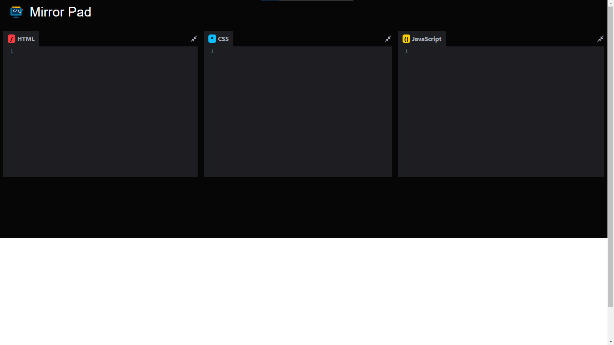

# Mirror Pad



Welcome to the **Mirror Pad** This is a basic Real Time Code Editor in which user can write and test code for **HTML, CSS & JAVASCRIPT**

---

## 😎 Live Demo

**Visit:** **https://mirrorpad.netlify.app/**

---

## 🚀 Features

- **Preview Pane-** When the user write's the code the code mirror(package used to render the code) render the output for the code simultaneously below in the preview pane within 1 second.

- **Local Storage-** The code written by the user is stored in the local storage, so if the user by mistaklely refresh the website then also the code is remains there itself.

- **Line Numbering-** Display line numbers for better code navigation.

## 🛠️ Tech Stack

- React JS
- Material UI

## ⚙️ Installation 

**Follow these steps to set up the project locally:**

1. Clone this repository:
```bash
git clone https://github.com/rishi190104/MirrorPad.git 
```

2. Navigate to the project directory:
```bash
cd MirrorPad
```

3. Install Dependencies:
```bash
npm install
```
4. Start the development server:
```bash
npm run start
```

---

## 📬 Contact
For questions, feedback, or support, feel free to reach out:

**GitHub:** rishi190104
**Email:** rs9911777@gmail.com